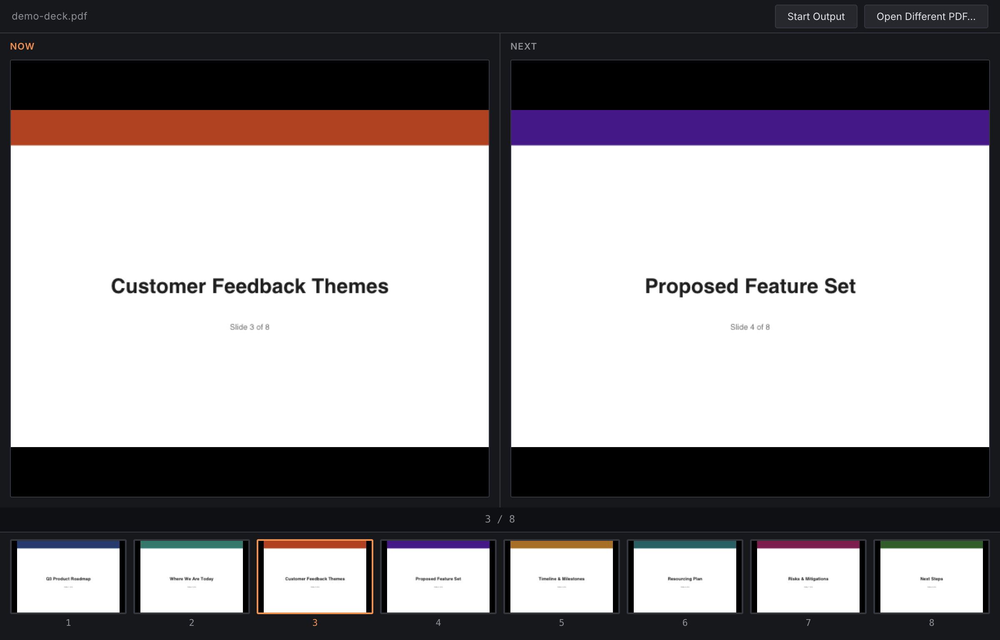
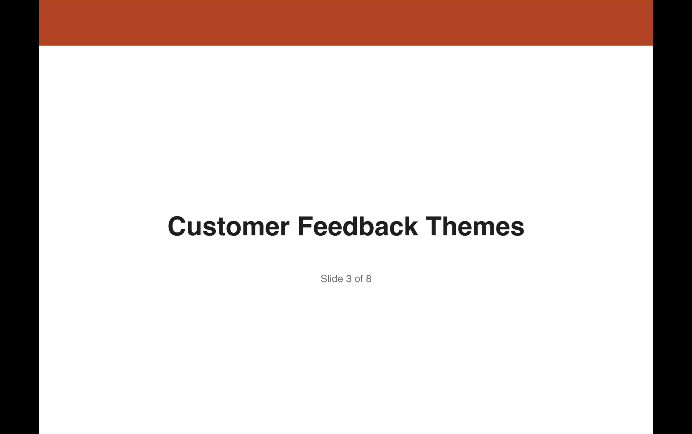

# PDF Presenter Lite

> **AI-assisted project.** This codebase was created with [Claude](https://claude.com/claude-code)
> (Anthropic), directed and reviewed by a human author — including architecture,
> implementation, and documentation. Review it accordingly before relying on it in
> production.

A minimal, single-purpose presenter tool: open a PDF, get a presenter view on one
screen (Now/Next preview plus a clickable slide thumbnail strip) and a clean
fullscreen output on a second screen — no notes panel, no NDI, no network
integrations. A stripped-down sibling of
[presentation-commander-client](https://github.com/allansargeant/presentation-commander-client),
keeping only its proven pdf.js rendering pipeline and multi-window/display-picker
pattern.





## Download

Prebuilt binaries are on the
[Releases page](https://github.com/allansargeant/pdf-presenter-lite/releases/latest),
covering both x64 and ARM64 on every platform — plus a combined "works on
either architecture" option for macOS and Windows if you'd rather not think
about which to pick:

- **macOS:** Universal (.dmg / .zip, runs on both Apple Silicon and Intel —
  recommended if unsure), or Apple Silicon-only / Intel-only for a smaller,
  single-architecture download. Unsigned, so Gatekeeper will block it on
  first launch. Right-click the app → Open, or run
  `xattr -cr "PDF Presenter Lite.app"` after extracting.
- **Windows:** a combined portable `.exe` covering both x64 and ARM64
  (recommended if unsure), or an x64-only / ARM64-only build for a smaller
  download. No installer either way, just run it directly. Unsigned, so
  SmartScreen will likely warn on first run ("More info" → "Run anyway").
- **Linux:** x64 or ARM64 (no combined option — `.deb`/`.rpm` packages are
  inherently single-architecture), as `.deb` (Debian/Ubuntu) or `.rpm`
  (Fedora/RHEL/openSUSE).

## What it does

- **Open a PDF** — renders locally with pdf.js, no other slide-source integrations
- **Presenter view** — a "Now" and "Next" preview side by side, plus a horizontal
  strip of thumbnails for every slide below them; click any thumbnail to jump
  straight to that slide
- **Keyboard navigation** — Left/Right arrows (or Space to advance)
- **Fullscreen Output window** — a second, chrome-free window showing just the
  current slide, for a projector or confidence monitor. Pick which connected
  display it opens on from a dropdown next to the toggle button

## Architecture

Two renderer views loaded from the same bundle, selected by a `mode` query param
(mirrors the Client Node's Program Out window pattern):

- `App.tsx` — the presenter view: loads the PDF, owns `currentPage`/`totalPages`,
  renders Now/Next + thumbnails, and pushes `{ data, currentPage }` to the Output
  window whenever it changes.
- `Output.tsx` — the fullscreen window. Pulls the current state via
  `output:get-state` once its own listener is mounted (rather than relying solely
  on a live push, which can race and get silently dropped if the window is still
  loading when the presenter pushes) and then stays in sync via `output:state`
  pushes for as long as it's open.

`pdf.ts` (the PDF loading/rendering helpers) is copied verbatim from
presentation-commander-client — same render-queue-per-canvas serialization to
avoid the transform-corruption bug documented there.

## Status

Built and verified end-to-end: opening a PDF, thumbnail-click navigation,
arrow-key navigation, and the fullscreen Output window (including a real race
condition in the initial state hand-off, found and fixed during testing) all
confirmed working against a real multi-page PDF.

## Project Setup

### Install

```bash
npm install
```

### Development

```bash
npm run dev
```

### Build

```bash
npm run build
npm run build:mac   # or build:win / build:linux
```
